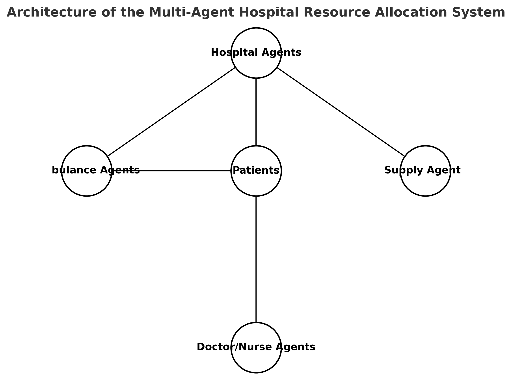

# Hospital-resource-allocation-mas
Decentralized Multi-Agent System for Hospital Resource Allocation and Emergency Response using SPADE.  Simulation of hospitals, ambulances, and medical staff coordinating autonomously to optimize patient routing,  resource management, and emergency handling.

# Multi-Agent Hospital Resource Allocation and Emergency Response System

## Overview
This repository contains the development of a **decentralized hospital resource allocation and emergency response system** using **Multi-Agent Systems (MAS)** with **SPADE**.  

The project simulates a healthcare network where multiple autonomous agents (hospitals, ambulances, medical staff, and supply units) coordinate to optimize patient flow, allocate resources efficiently, and respond to emergencies in real-time, without relying on a central controller.  

**Note:** This project is currently **in progress** and under active development. The repository will be updated iteratively as the system evolves.

---

## Objectives
- Simulate a hospital network using autonomous agents.
- Optimize the allocation of beds, medical staff, ambulances, and supplies.
- Enable priority response for critical and emergency cases.
- Demonstrate the advantages of decentralized decision-making in healthcare environments.

---

## System Architecture
The system is composed of the following agent types:

- **Hospital Agents** – manage beds, staff availability, and supplies; decide whether to admit or redirect patients.  
- **Ambulance Agents** – transport patients and select hospitals based on proximity and current availability.  
- **Doctor/Nurse Agents** – represent medical staff with limited treatment capacity, prioritizing patients by severity.  
- **Supply Agents** – manage the distribution of critical resources (medicine, oxygen, PPE) across hospitals.  

Agents interact through **peer-to-peer communication protocols**, including the **Contract Net Protocol (CNP)**, to ensure coordination in patient routing, admissions, and resource allocation.

---

## Dynamic Environment
The simulation incorporates real-world variability, including:
- Unpredictable patient arrivals (epidemics, mass accidents).
- Limited resources (beds, staff hours, medical supplies).
- Supply shortages and surges in patient demand.
- Emergency scenarios requiring rapid adaptation and coordination.

---

## Evaluation Metrics
The system will be evaluated based on:
- Number of patients successfully treated.
- Average patient waiting and transport time.
- Resource utilization (beds, staff, supplies).
- Fairness of resource distribution across hospitals.
- Responsiveness under emergency conditions.

---

## Technologies
- **Python 3.x**  
- **SPADE (Smart Python Agent Development Environment)**  
- **NetworkX** (for modeling agent interactions)  
- **Matplotlib / Visualization tools** (for system monitoring and simulation output)  

---

## Roadmap (Work in Progress)
- [ ] Weeks 1–2: System design; initial implementation of Hospital and Ambulance agents.  
- [ ] Week 3: Agent communication and basic patient routing.  
- [ ] Week 4: Resource constraints (beds, staff, supplies).  
- [ ] Week 5: Collaboration protocols (Contract Net Protocol) and emergency prioritization.  
- [ ] Week 6: Visualization and performance evaluation under stress-test scenarios.  

---

## Architecture Diagram
A conceptual diagram of the system architecture is provided below (to be refined as the project progresses):

